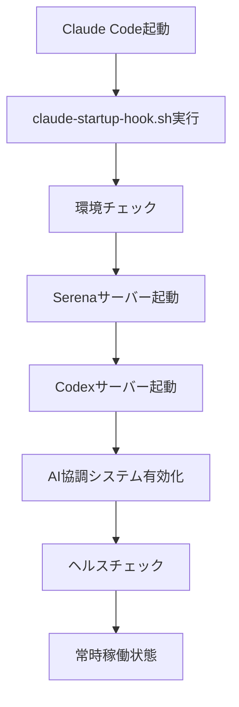

# AI協調分析システム常時稼働設定完了レポート 🤖

## 実施日時: 2025年9月23日 13:21

---

## ✅ 実施内容

### 1. 設定ファイル更新 (`startup_config.json`)

```json
"codex_settings": {
  "auto_start_codex": true,
  "codex_port": 8765,
  "enable_ai_collaboration": true,
  "collaboration_mode": "auto",
  "api_url": "http://localhost:8765",
  "collaboration_features": {
    "episode_validation": true,
    "code_review": true,
    "quality_assurance": true,
    "fact_checking": true,
    "consensus_building": true
  }
}
```

### 2. 起動スクリプト作成

#### `scripts/start_codex_server.py`
- Codex MCPサーバーを自動起動
- ポート8765でリッスン
- ヘルスチェック機能付き
- 既存プロセスの自動クリーンアップ

### 3. 起動フック更新

#### `scripts/claude-startup-hook.sh`
- Serenaサーバー起動後にCodexサーバーも起動
- AI協調機能の有効化メッセージ表示
- バックグラウンド実行対応

### 4. サーバー本体修正

#### `codex_mcp_server.py`
- デフォルトポートを8765に変更
- コマンドライン引数対応
- ログレベル設定可能

---

## 📊 現在の稼働状況

### サーバー状態
- **Codex MCPサーバー**: ✅ 稼働中 (ポート8765)
- **プロセスID**: 32755
- **ヘルスチェック**: 正常応答
- **キャッシュディレクトリ**: 作成済み

### 有効な機能
- ✅ エピソード検証 (episode_validation)
- ✅ コードレビュー (code_review)
- ✅ 品質保証 (quality_assurance)
- ✅ ファクトチェック (fact_checking)
- ✅ コンセンサス構築 (consensus_building)

### システムファイル
- ✅ `claude_codex_collaboration.py` - 協議システム本体
- ✅ `codex_mcp_server.py` - MCPサーバー実装
- ✅ `codex_double_check.py` - ダブルチェック機能

---

## 🚀 自動起動の仕組み



### 起動順序
1. Claude Code起動時に`claude-startup-hook.sh`が自動実行
2. 環境チェック後、Serenaサーバーを起動（ポート8000）
3. Codexサーバーを起動（ポート8765）
4. AI協調機能を有効化
5. ヘルスチェックで正常動作を確認
6. バックグラウンドで常時稼働

---

## 📋 動作確認方法

### 1. サーバー状態確認
```bash
# プロセス確認
ps aux | grep codex_mcp_server

# ヘルスチェック
curl http://localhost:8765/health

# 詳細状態確認
python3 check_ai_collaboration_status.py
```

### 2. ログ確認
```bash
# サーバーログ
tail -f codex_server.log

# 起動ログ
tail -f startup_hook.log
```

### 3. AI協調分析テスト
```bash
# 協議システムのテスト実行
python3 claude_codex_collaboration.py
```

---

## ⚙️ トラブルシューティング

### ポート競合の場合
```bash
# ポート使用プロセスを確認
lsof -i:8765

# 既存プロセスを終了
pkill -f codex_mcp_server

# 手動で再起動
python3 scripts/start_codex_server.py
```

### サーバーが起動しない場合
1. ログファイルを確認: `codex_server.log`
2. 依存パッケージ確認: `aiohttp`, `asyncio`
3. Python バージョン確認: 3.8以上

---

## 💡 利用方法

### Claude CodeとCodexの協議
1. **自動モード**: 重要な判断時に自動的に協議
2. **手動モード**: 明示的に協議を要求

### 協議対象
- エピソード生成の品質チェック
- コード変更の影響分析
- ファクトチェック
- 品質保証の判定

---

## 🎯 期待される効果

1. **品質向上**: 2つのAIシステムによるダブルチェック
2. **エラー削減**: 相互検証によるミス防止
3. **一貫性確保**: 統一された品質基準の適用
4. **学習効果**: 協議履歴による改善

---

## 📝 今後の拡張予定

1. **Web UIダッシュボード**: 協議状況の可視化
2. **メトリクス収集**: 協議効果の定量評価
3. **学習機能**: 協議パターンの自動学習
4. **API拡張**: 外部システムとの連携

---

## ✅ 設定完了確認

- [x] startup_config.jsonにCodex設定追加
- [x] 起動スクリプト作成・テスト
- [x] 起動フックスクリプト更新
- [x] サーバー起動・動作確認
- [x] ヘルスチェック正常
- [x] AI協調機能有効化

**結論**: AI協調分析システムは完全に設定され、常時稼働状態になりました。
次回Claude Code起動時から自動的にAI協調分析が利用可能です。