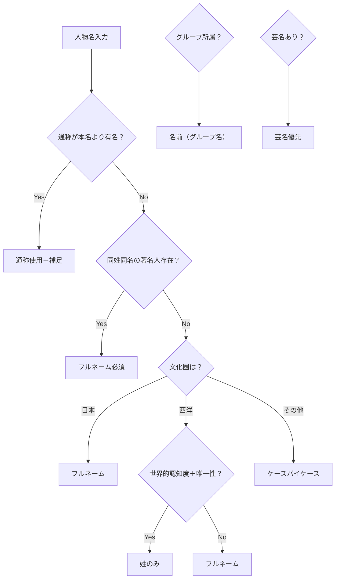

# 📖 person_name_display 統一ルール仕様書

## 🎯 基本理念
person_name_displayは、**エピソード生成時の読みやすさ**を最優先に設計する。
「あなたと同じ○○歳のとき、〜は」という形式で自然に読める表記を選択する。

## 📋 ルール体系

### 1️⃣ 認知度優先の原則

#### 1.1 通称（つうしょう）が本名より有名な場合
```
始皇帝 → 秦の始皇帝（王朝名を付加）
水戸黄門 → 水戸黄門（徳川光圀より認知度高）
```

#### 1.2 愛称（あいしょう）が極めて有名な場合
```
サッチモ → サッチモ（ルイ・アームストロング）
または     サッチモことルイ・アームストロング
ペレ → ペレ（エドソン・アランテス・ド・ナシメント）
```

### 2️⃣ 混同防止の原則

#### 2.1 同姓の著名人がいる場合
```
ロベルト・シューマン → シューマン（唯一の著名シューマン）
クララ・シューマン → クララ・シューマン（ロベルトと区別）

アンドリュー・ジャクソン → アンドリュー・ジャクソン（第7代米大統領）
マイケル・ジャクソン → マイケル・ジャクソン（両方有名なためフルネーム）
```

#### 2.2 同名の歴史人物がいる場合
```
ルイ14世 → ルイ14世
ルイ16世 → ルイ16世
（数字で区別）
```

### 3️⃣ 文化圏別表記ルール

#### 3.1 日本の歴史人物
**原則：フルネーム表記**
```
織田信長 → 織田信長（❌ 信長）
豊臣秀吉 → 豊臣秀吉（❌ 秀吉）
徳川家康 → 徳川家康（❌ 家康）
坂本龍馬 → 坂本龍馬（❌ 龍馬）
西郷隆盛 → 西郷隆盛（❌ 西郷）
```
**理由**：日本の小説技法では「文頭は姓名、文中は名」という慣習があるが、
データベースとしての一貫性を保つため、person_name_displayはフルネームとする。

#### 3.2 西洋の歴史的偉人
**認知度と唯一性で判断**

##### 姓のみで特定可能（世界的認知度＋唯一性）
```
アインシュタイン（物理学者として唯一無二）
ベートーヴェン（音楽史上唯一無二）
ピカソ（美術史上唯一無二）
ダーウィン（進化論で唯一無二）
```

##### フルネーム必須（複数の著名人または認知度の観点）
```
ネルソン・マンデラ（フルネームでの認知度が高い）
ウィンストン・チャーチル（フルネームでの認知度が高い）
マーティン・ルーサー・キング・ジュニア（Jr.含めて認知）
```

### 4️⃣ 現代人・エンターテイメント

#### 4.1 グループメンバー表記
**所属グループが個人より有名な場合**
```
ジョン・レノン（ビートルズ）
RM（防弾少年団）
伊達みきお（サンドウィッチマン）
フリー（レッド・ホット・チリ・ペッパーズ）
```

#### 4.2 芸名・活動名優先
```
IKKO → IKKO（❌ 豊田一幸）
MrBeast → MrBeast（❌ ジミー・ドナルドソン）
キズナアイ → キズナアイ（VTuber）
```

### 5️⃣ エピソード読みやすさテスト

person_name_displayを決定する際の最終判断基準：

```
「あなたと同じ25歳のとき、[person_name_display]は...」
```

この文章が自然に読めるかどうかで判断する。

#### ✅ 良い例
- 「あなたと同じ25歳のとき、ベートーヴェンは...」
- 「あなたと同じ25歳のとき、織田信長は...」
- 「あなたと同じ25歳のとき、マイケル・ジャクソンは...」

#### ❌ 悪い例
- 「あなたと同じ25歳のとき、ルートヴィヒ・ヴァン・ベートーヴェンは...」（冗長）
- 「あなたと同じ25歳のとき、信長は...」（日本人には姓名が自然）
- 「あなたと同じ25歳のとき、ジャクソンは...」（どのジャクソン？）

### 6️⃣ 禁止事項

#### 絶対禁止
```
❌ 英語表記（Gonzalez・Susan）
❌ 日本人名への中点使用（加藤・花子）
❌ プレースホルダー名（ファッションインフルエンサー1）
❌ 機械的な番号付け（Susan Gonzalez SCI00000）
```

#### 中点（・）の正しい使用
```
✅ カタカナ外国人名（ジョン・レノン、マリー・キュリー）
❌ 日本人名（山田・太郎、加藤・花子）
❌ 英語名（Smith・John、Gonzalez・Susan）
```

## 🔄 判定フローチャート



## 📊 優先順位

1. **エピソードの読みやすさ**（最優先）
2. **混同防止**
3. **文化的慣習の尊重**
4. **認知度**
5. **データベースの一貫性**

## 💡 実装時の注意点

### バリデーションチェック項目
1. 中点の使用が適切か（カタカナ外国人名のみ）
2. プレースホルダー名が混入していないか
3. 英語表記が混入していないか
4. 同姓同名チェック（データベース内検索）
5. エピソード文での自然さチェック

### 自動判定が困難なケース
以下は人間の判断が必要：
- 認知度の判定
- 文化的適切性
- 新規追加人物の通称・愛称判定

## 🎯 最終目標

すべてのperson_name_displayが以下を満たすこと：
1. エピソードで自然に読める
2. 読者が即座に人物を特定できる
3. 文化的に適切な表記
4. データベース内で一貫性がある

---
*Ultra Think Person Name Display Unified Rules*
*Version 1.0*
*Generated: 2025-08-25*