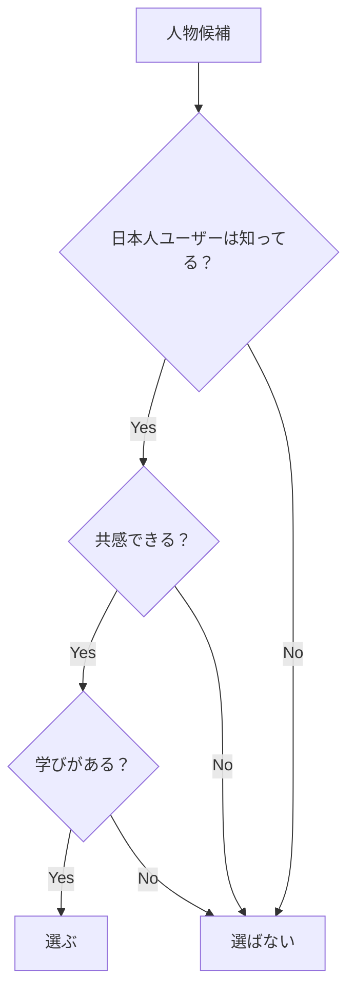

# 📖 人物選出の哲学

## 基本理念

### 「地域バランス」より「ユーザー価値」

従来の考え方 ❌
```
「世界各国から平等に選ぶべき」
「地域の多様性を確保すべき」
「すべての大陸から代表者を」

問題点：
- 日本人に馴染みのない人物が増える
- 共感を得られない人物が混ざる
- データベースの価値が薄まる
```

新しい考え方 ✅
```
「日本人ユーザーに価値があるかだけを考える」
「国籍は結果であって目的ではない」
「響かない人物は入れない」

メリット：
- すべての人物に意味がある
- ユーザーの満足度が高い
- 無駄なデータがない
```

## 実例で考える

### ケース1：YouTuber選定

❌ バランス重視の選定
```
日本: HIKAKIN
アメリカ: MrBeast
イギリス: PewDiePie
ドイツ: Gronkh（誰？）
ブラジル: Felipe Neto（誰？）
インド: Carry Minati（誰？）
→ 半分は日本人に響かない
```

✅ ユーザー価値重視の選定
```
HIKAKIN（日本）
はじめしゃちょー（日本）
MrBeast（アメリカ）
PewDiePie（イギリス）
Ryan Kaji（アメリカ/日系）
→ 全員が日本で知られている
```

### ケース2：起業家選定

❌ バランス重視の選定
```
各大陸から2名ずつ：
アジア: 孫正義、Jack Ma
北米: イーロン・マスク、ビル・ゲイツ
南米: ???（日本人は知らない）
アフリカ: ???（日本人は知らない）
オセアニア: ???（日本人は知らない）
→ 無理やり入れた人物に価値がない
```

✅ ユーザー価値重視の選定
```
孫正義（日本）
柳井正（日本）
三木谷浩史（日本）
前澤友作（日本）
イーロン・マスク（アメリカ）
スティーブ・ジョブズ（アメリカ）
ジャック・マー（中国）
→ 全員が日本人にとって参考になる
```

## カテゴリ別の実態

### エンターテインメント
```
自然な結果：
- 日本のお笑い芸人 → ほぼ100%日本人
- 声優 → 95%日本人、5%海外の有名声優
- K-POP → 100%韓国人
- ハリウッドスター → 90%アメリカ人

これで良い理由：
日本人が実際に見て楽しんでいる人物だから
```

### スポーツ
```
自然な結果：
- 野球 → 60%日本人、30%MLB、10%その他
- サッカー → 30%日本人、70%海外有名選手
- テニス → 錦織圭、大坂なおみ、フェデラー等

これで良い理由：
日本人が実際に応援・注目している選手だから
```

### 歴史的教訓
```
自然な結果：
- 第二次世界大戦関連 → ドイツ、日本中心
- テロリスト → 中東、日本（オウム）
- 独裁者 → 各国に散在

これで良い理由：
日本人が学ぶべき歴史的教訓だから
```

## 選定の判断フロー



## FAQ

### Q: これは差別では？
**A: 違います。**
ターゲットユーザーに最適化することは、すべてのプロダクトで行われています。
アメリカのアプリならアメリカ人向けに、韓国のアプリなら韓国人向けに最適化します。

### Q: 多様性は重要では？
**A: 重要ですが、形式的な多様性より実質的な価値を重視します。**
日本人に響かない人物を入れても、多様性の意味がありません。

### Q: 偏りが生じるのでは？
**A: 偏りは自然な結果です。**
日本人ユーザーの興味・関心を反映した偏りは、むしろ価値となります。

## 具体的な数値予測

12,410人を選んだ場合の予測分布：

```
日本: 40-50%（4,964-6,205人）
  理由：言語、文化、親近感

アメリカ: 20-30%（2,482-3,723人）
  理由：エンタメ、IT、ビジネスの中心

韓国: 5-10%（620-1,241人）
  理由：K-POP、韓流ブーム

中国: 3-5%（372-620人）
  理由：ビジネス、歴史的つながり

イギリス: 3-5%（372-620人）
  理由：サッカー、音楽

その他: 10-20%（1,241-2,482人）
  理由：各分野のスター、歴史的人物
```

**重要：これは目標ではなく、自然な結果の予測**

## まとめ

### やること
- 日本人ユーザーの視点で選ぶ
- 知名度と共感性を重視
- 学びや感銘のある人物を選ぶ

### やらないこと
- 地域バランスのための選出
- 形式的な多様性の追求
- 日本人に響かない人物の追加

### 最終ゴール
**「日本人ユーザーが毎日開きたくなる、価値あるデータベース」**

---

*ユーザーファーストの選定基準*
*最終更新: 2025年8月22日*
