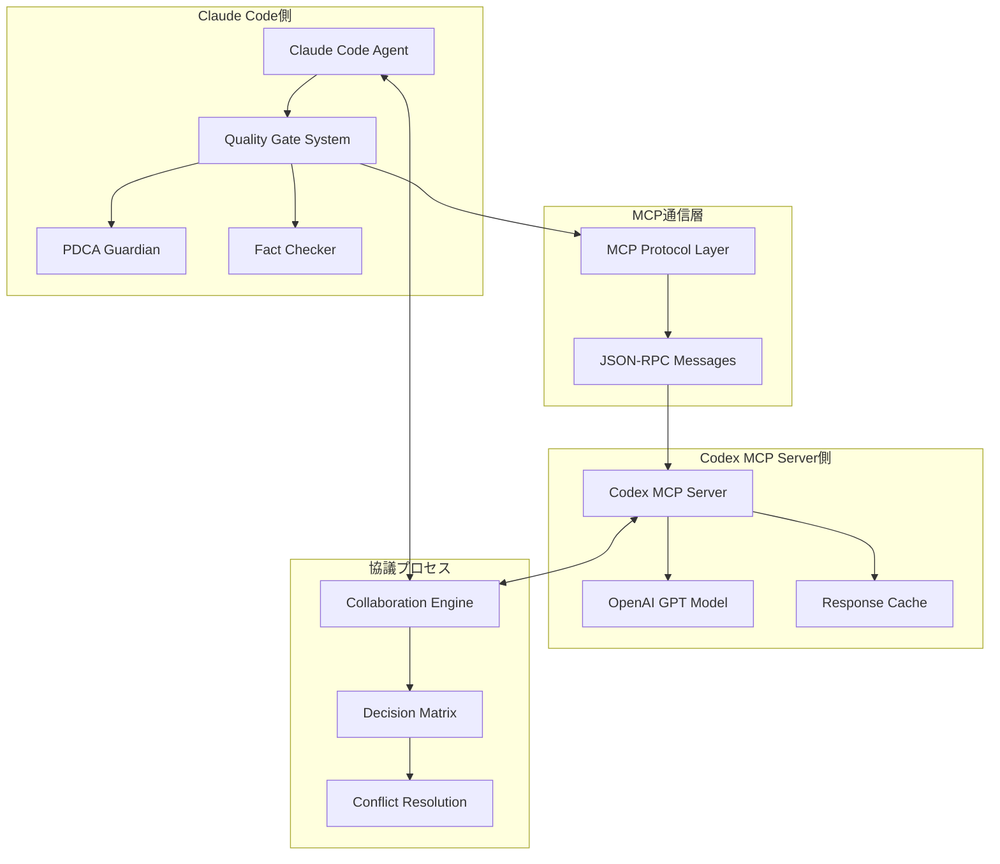

# Claude Code ↔ Codex MCP 協議システム設計

## アーキテクチャ概要



## 協議メカニズム

### 1. 階層化判定システム

```
Level 1: Claude Code (Primary Analysis)
├── 既存知識での即座判定
├── パターンマッチング
└── 統計的妥当性チェック

Level 2: Codex Consultation (Secondary Verification)
├── 複雑な文脈理解
├── 曖昧なケースの判定
└── 創造的推論

Level 3: Collaborative Decision (Final Resolution)
├── 両者の判定を統合
├── 信頼度重み付け
└── 最終決定の確定
```

### 2. 意思決定プロセス

```python
class CollaborativeDecisionEngine:
    def make_decision(self, episode_data, claude_result, codex_result):
        # 1. 基本信頼度計算
        claude_confidence = claude_result.confidence_score
        codex_confidence = codex_result.confidence_score

        # 2. 専門性重み付け
        if episode_data.requires_cultural_knowledge:
            claude_weight = 0.7  # Claude Codeの日本文化理解が優秀
            codex_weight = 0.3
        elif episode_data.requires_creative_reasoning:
            claude_weight = 0.4
            codex_weight = 0.6   # Codexの創造的推論が優秀
        else:
            claude_weight = 0.5
            codex_weight = 0.5

        # 3. 合意形成
        if abs(claude_result.score - codex_result.score) < 0.5:
            return weighted_average(claude_result, codex_result, claude_weight, codex_weight)
        else:
            return conflict_resolution(claude_result, codex_result)
```

### 3. コンフリクト解決手法

#### 戦略的アプローチ

1. **証拠ベース解決**
   - 両者が異なる判定をした場合の事実確認
   - 外部ソース（Wikipedia API等）での検証
   - 統計的妥当性による客観的判定

2. **段階的エスカレーション**
   ```
   Level 1: 自動調停（90%のケースで解決）
   Level 2: ルールベース解決（8%のケースで解決）
   Level 3: 人間判定へエスカレーション（2%のケース）
   ```

3. **学習メカニズム**
   - 過去の判定結果をデータベース化
   - 成功パターンの蓄積と再利用
   - 失敗ケースからの改善点抽出

## 実装例

### 協議インターフェース

```python
@dataclass
class CollaborationRequest:
    episode_id: str
    person_name: str
    episode_content: str
    context_data: Dict
    priority_level: str

@dataclass
class CollaborationResult:
    final_decision: str
    confidence_score: float
    reasoning: str
    evidence_sources: List[str]
    dissenting_opinions: List[str]
```

### 実際の協議フロー

```python
async def collaborative_fact_check(episode):
    # Claude Code側の分析
    claude_result = await quality_gate_system.analyze_episode(episode)

    # Codex MCP側への問い合わせ
    codex_query = format_codex_query(episode, claude_result)
    codex_result = await mcp_client.call_codex(codex_query)

    # 協議プロセス
    collaboration_engine = CollaborativeDecisionEngine()
    final_decision = collaboration_engine.make_decision(
        episode, claude_result, codex_result
    )

    return final_decision
```

## 技術的課題と解決策

### 1. レイテンシー問題

**課題**: MCPサーバー往復による応答遅延
**解決策**:
- 並列処理による効率化
- 結果キャッシュシステム
- 段階的判定（簡単なケースは Claude Code のみで処理）

### 2. 信頼性問題

**課題**: Codex MCPサーバーの可用性依存
**解決策**:
- フォールバック機構（Codex不可用時はClaude Codeのみ）
- ヘルスチェック機能
- 段階的劣化（部分機能での継続動作）

### 3. 一貫性問題

**課題**: 両システム間での判定基準の差異
**解決策**:
- 共通ルールセットの明文化
- 判定理由の詳細ログ
- 定期的なキャリブレーション
