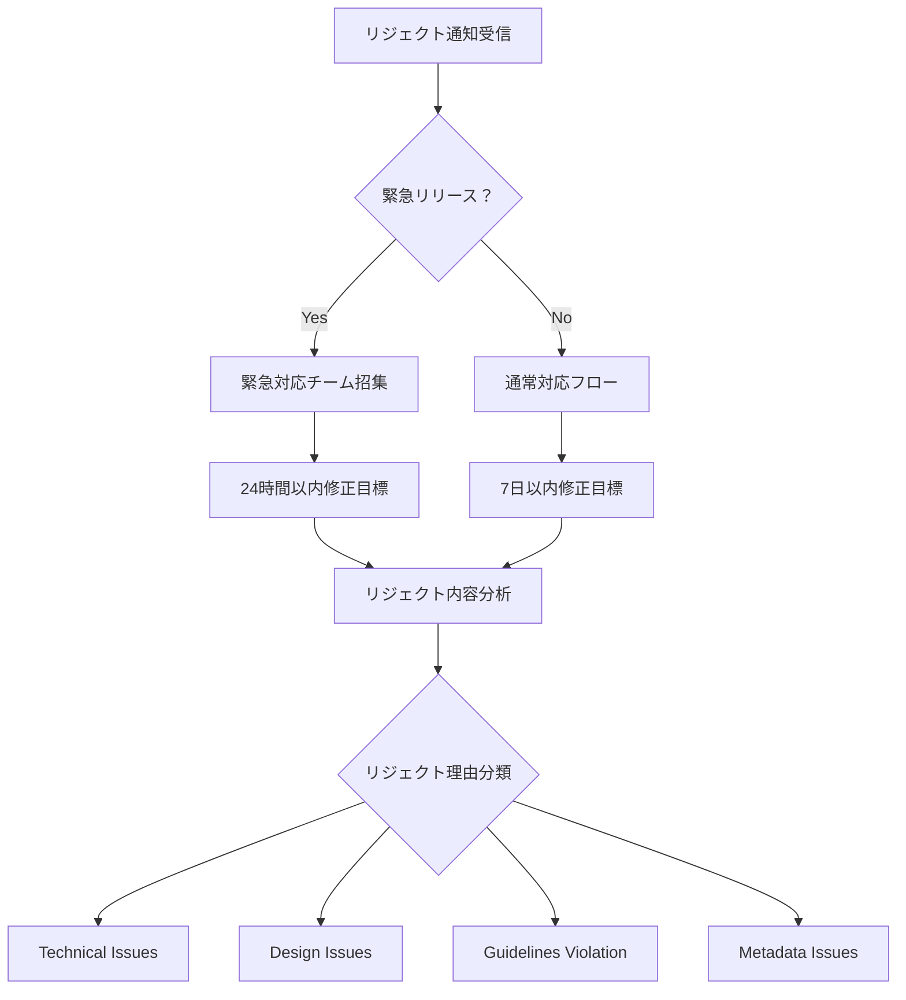

# App Store リジェクト対応フローチャート

## 📋 リジェクト通知受信時の初期対応

### Phase 1: 緊急度判定 (受信後1時間以内)



### 緊急度レベル定義
- **Level 1 (緊急)**: セキュリティ修正、クリティカルバグ修正
- **Level 2 (高)**: 新機能リリース、重要なアップデート
- **Level 3 (中)**: 改善アップデート、軽微な機能追加
- **Level 4 (低)**: 小規模な修正、翻訳更新

## 📊 リジェクト理由別対応マトリックス

### Technical Issues (技術的問題)

| リジェクト理由 | 対応時間 | 担当 | アクション | 防止策 |
|---|---|---|---|---|
| アプリクラッシュ | 2-6時間 | エンジニア | 緊急修正+テスト | より厳格なQAプロセス |
| パフォーマンス問題 | 1-2日 | エンジニア | 最適化実装 | パフォーマンステスト自動化 |
| プライベートAPI使用 | 1-3日 | エンジニア | 代替API実装 | 静的解析ツール導入 |
| メモリリーク | 4-8時間 | エンジニア | リーク修正 | Instrumentsテスト強化 |
| バックグラウンド処理問題 | 1日 | エンジニア | 処理見直し | バックグラウンドテスト追加 |

### Design Issues (デザイン問題)

| リジェクト理由 | 対応時間 | 担当 | アクション | 防止策 |
|---|---|---|---|---|
| HIG準拠問題 | 1-2日 | デザイナー | デザイン修正 | HIGレビューチェック |
| アクセシビリティ | 2-3日 | デザイナー+エンジニア | VoiceOver対応等 | アクセシビリティテスト |
| アイコン問題 | 2-4時間 | デザイナー | アイコン作成 | アイコンガイドライン確認 |
| スクリーンショット | 1-2時間 | デザイナー | 再撮影・編集 | スクリーンショット仕様書 |
| UI不具合 | 4-8時間 | デザイナー+エンジニア | UI修正 | UIテストケース強化 |

### Guidelines Violation (ガイドライン違反)

| リジェクト理由 | 対応時間 | 担当 | アクション | 防止策 |
|---|---|---|---|---|
| プライバシーポリシー | 1-2日 | 法務+PM | ポリシー更新 | プライバシー監査定期実施 |
| データ収集問題 | 2-3日 | エンジニア+法務 | 収集方法変更 | データ監査プロセス |
| 年齢制限違反 | 1-2日 | PM+法務 | コンテンツ見直し | 年齢制限ガイドライン確認 |
| 課金システム問題 | 2-4日 | エンジニア+法務 | 課金フロー修正 | 課金ガイドライン研修 |
| コンテンツガイドライン | 1-3日 | PM+デザイナー | コンテンツ修正 | コンテンツ審査プロセス |

### Metadata Issues (メタデータ問題)

| リジェクト理由 | 対応時間 | 担当 | アクション | 防止策 |
|---|---|---|---|---|
| アプリ説明文 | 1-2時間 | PM+マーケティング | 説明文修正 | 説明文レビューprocess |
| キーワード問題 | 1時間 | PM+マーケティング | キーワード変更 | キーワード戦略見直し |
| 価格設定問題 | 30分 | PM | 価格調整 | 価格戦略文書化 |
| カテゴリー問題 | 30分 | PM | カテゴリー変更 | カテゴリー選択ガイド |

## 🔧 対応プロセス詳細

### Step 1: リジェクト内容の詳細分析

```bash
# リジェクト分析チェックリスト
REJECT_ANALYSIS_CHECKLIST=(
    "リジェクト理由の正確な把握"
    "Guidelines番号の確認"
    "具体的な修正要求の理解"
    "影響範囲の特定"
    "修正難易度の評価"
    "修正時間の見積もり"
)
```

#### 分析テンプレート
```markdown
## リジェクト分析レポート

**受信日時**: [日時]
**アプリ名**: [アプリ名]
**バージョン**: [バージョン]
**リジェクト理由**: [Appleからの理由]
**Guidelines参照**: [該当番号]

### 詳細分析
- **問題の内容**: [具体的な問題]
- **影響範囲**: [影響を受ける機能・画面]
- **修正の複雑さ**: [Low/Medium/High]
- **修正時間見積**: [時間]
- **リスク評価**: [修正による副作用]

### 対応計画
1. [対応ステップ1]
2. [対応ステップ2]
3. [対応ステップ3]

### 担当者
- **主担当**: [名前]
- **レビュワー**: [名前]
- **承認者**: [名前]
```

### Step 2: 迅速修正プロセス

#### 技術的問題の修正プロセス
```bash
#!/bin/bash
# technical_fix_process.sh

echo "🔧 技術的問題修正プロセス開始"

# 1. 問題の再現
echo "📋 問題の再現確認"
reproduce_issue() {
    # テストケース実行
    xcodebuild test -scheme YourApp -destination 'platform=iOS Simulator,name=iPhone 14'

    # クラッシュログ確認
    check_crash_logs

    # パフォーマンス測定
    run_performance_tests
}

# 2. 修正実装
echo "🛠️ 修正実装"
implement_fix() {
    # バックアップ作成
    git checkout -b "hotfix/app-store-rejection-$(date +%Y%m%d)"

    # 修正コード実装
    # [修正内容に応じて実装]

    # 修正の検証
    run_fix_validation
}

# 3. 包括的テスト
echo "🧪 包括的テスト実行"
comprehensive_testing() {
    # 単体テスト
    run_unit_tests

    # UIテスト  
    run_ui_tests

    # 回帰テスト
    run_regression_tests

    # パフォーマンステスト
    run_performance_tests

    # メモリリークテスト
    run_memory_leak_tests
}

# 4. 品質チェック
echo "✅ 品質チェック"
quality_check() {
    # コード品質チェック
    python3 scripts/code_quality_check.py .

    # セキュリティチェック
    run_security_scan

    # Guidelines準拠チェック
    run_guidelines_compliance_check
}
```

#### デザイン問題の修正プロセス
```bash
#!/bin/bash
# design_fix_process.sh

echo "🎨 デザイン問題修正プロセス開始"

# 1. HIG準拠チェック
hig_compliance_check() {
    echo "📐 Human Interface Guidelines準拠確認"

    # カラーコントラスト確認
    check_color_contrast

    # タッチターゲットサイズ確認
    check_touch_targets

    # フォントサイズ確認
    check_font_sizes

    # レイアウト確認
    check_layout_constraints
}

# 2. アクセシビリティ確認
accessibility_check() {
    echo "♿ アクセシビリティ確認"

    # VoiceOver対応
    check_voiceover_support

    # Dynamic Type対応
    check_dynamic_type

    # カラーバリエーション対応
    check_color_blind_support
}

# 3. デバイス別確認
device_compatibility_check() {
    echo "📱 デバイス互換性確認"

    # iPhone各サイズでの表示確認
    test_on_iphone_se
    test_on_iphone_14
    test_on_iphone_14_pro_max

    # iPad対応確認（Universal Appの場合）
    test_on_ipad
    test_on_ipad_pro
}
```

### Step 3: Apple審査チームとのコミュニケーション

#### 効果的なコミュニケーション戦略

**1. Resolution Center活用**
```markdown
Subject: Re: [App Name] - Version [Version] - Rejection Resolution

Dear App Store Review Team,

Thank you for your feedback regarding [App Name] version [Version].

We have carefully reviewed the rejection reason: "[具体的なリジェクト理由]"

We have made the following changes to address your concerns:

1. [修正内容1]
   - Technical implementation: [技術的詳細]
   - Testing conducted: [実施したテスト]

2. [修正内容2]
   - Design changes: [デザイン変更内容]
   - Accessibility improvements: [アクセシビリティ改善]

We have attached screenshots demonstrating the fixes and conducted comprehensive testing on:
- iPhone SE (iOS 15.0)
- iPhone 14 (iOS 16.0)  
- iPhone 14 Pro Max (iOS 17.0)
- iPad Pro 12.9" (iPadOS 17.0)

We believe these changes fully address the concerns raised and comply with the App Store Review Guidelines section [該当セクション].

Demo Account (if applicable):
Username: [username]
Password: [password]

Thank you for your time and consideration. Please let us know if you need any additional information.

Best regards,
[Name]
[Title]
[Company]
[Contact Information]
```

**2. 電話での説明要請（必要時）**
- 複雑な技術的問題
- Guidelines解釈に関する疑問
- 修正が困難な場合

### Step 4: 再提出準備

#### 再提出前チェックリスト
```bash
#!/bin/bash
# pre_resubmission_check.sh

echo "📝 再提出前最終チェック"

# 1. 修正内容の確認
verify_fixes() {
    echo "✅ 修正内容確認"

    # 指摘された問題の修正確認
    check_reported_issues_fixed

    # 副作用の確認
    check_side_effects

    # パフォーマンス影響確認
    check_performance_impact
}

# 2. 全機能テスト
full_functionality_test() {
    echo "🧪 全機能テスト"

    # メイン機能テスト
    test_core_functionality

    # エッジケーステスト
    test_edge_cases

    # エラーハンドリングテスト
    test_error_handling
}

# 3. Guidelines準拠最終確認
final_guidelines_check() {
    echo "📋 Guidelines最終確認"

    # 修正に関連するGuidelines確認
    check_related_guidelines

    # 全体的なGuidelines準拠確認
    run_full_guidelines_scan
}

# 4. メタデータ確認
metadata_verification() {
    echo "📊 メタデータ確認"

    # What's New欄の更新
    update_whats_new

    # バージョン番号の確認
    verify_version_number

    # テスター用ノートの更新
    update_reviewer_notes
}
```

## 📈 継続改善プロセス

### リジェクト原因分析

#### 月次リジェクト分析レポート
```python
# monthly_reject_analysis.py

class RejectAnalyzer:
    def generate_monthly_report(self):
        """月次リジェクト分析レポート生成"""

        report = {
            "period": "2024年1月",
            "total_submissions": 5,
            "rejections": 2,
            "rejection_rate": "40%",
            "categories": {
                "Technical Issues": 1,
                "Design Issues": 0,
                "Guidelines Violation": 1,
                "Metadata Issues": 0
            },
            "common_issues": [
                "プライベートAPI使用",
                "プライバシーポリシー更新必要"
            ],
            "resolution_time": {
                "average": "2.5日",
                "fastest": "1日",
                "slowest": "4日"
            },
            "improvements": [
                "静的解析ツールの導入",
                "プライバシー監査プロセスの強化"
            ]
        }

        return report
```

### プロセス改善施策

#### 1. 予防的措置の強化
- **静的解析ツールの導入**: プライベートAPI検出
- **自動化テストの拡充**: 回帰防止
- **コードレビュープロセス**: Guidelines準拠チェック

#### 2. 知識共有の促進
- **リジェクト事例データベース**: 過去事例の蓄積
- **ガイドライン研修**: 定期的な学習会
- **ベストプラクティス共有**: チーム内知識共有

#### 3. 品質管理体制の強化
- **リリース前チェックリスト**: 必須確認項目
- **複数人レビュー**: 見落とし防止
- **品質メトリクス監視**: 品質傾向分析

## 🚨 エスカレーション基準

### Level 1: チーム内対応
- 軽微な修正（1日以内）
- 経験済み問題
- 明確な修正方法

### Level 2: 上司・マネージャー報告
- 修正時間2-3日
- リリース計画への影響
- 複雑な技術的問題

### Level 3: 経営陣報告
- 修正時間1週間以上
- ビジネス影響大
- 法的リスク

### Level 4: 外部専門家相談
- Guidelines解釈不明
- 法的アドバイス必要
- 技術的解決困難

---

**最終更新**: 2024年8月
**作成者**: iOS Development Team
**承認者**: Technical Lead
